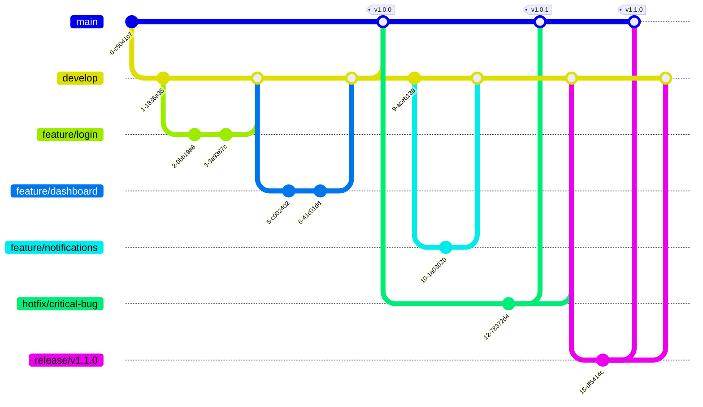

# React Boilerplate

## Introduction

This template provides a complete setup for React to work in Vite with SWC mode. It's designed to help you quickly start a new React project with modern technologies and an optimized project structure.

### System Requirements

- Node: >= 18.16.0
- NPM or Yarn

### Core Technology Versions

- React: v18.2.0
- Vite: 5.0.8
- TypeScript: 5.2.2

## Installation and Running the Project

### Installing Dependencies

Use [npm](https://www.npmjs.com/) to install packages.

```bash
# Install dependencies
npm install

# Set up Husky for development environment
./node_modules/.bin/husky install
```

### Running the Project in Development Mode

```bash
# Start development server
npm run dev
```

The application will run at the default address: http://localhost:3000

### Building the Project for Production

```bash
# Build for production
npm run build
```

Build results will be saved in the `dist/` directory.

### Running the Project in Production Mode (after building)

```bash
# Preview production build
npm run preview
```

### Checking and Fixing Coding Conventions

```bash
# Check ESLint errors
npm run lint

# Automatically fix ESLint errors
npm run lint:fix

# Check Prettier errors
npm run prettier

# Automatically fix Prettier errors
npm run prettier:fix
```

## Technologies Used

### Core

- **React 18**: Modern UI library with new features like Concurrent Mode, Suspense, and improved hooks.
- **Vite + SWC**: Fast, efficient build tool with SWC replacing Babel for faster compilation.
- **TypeScript**: Static type support, helping to detect errors early and improve development experience.

### State and Data Management

- **[React Query](https://tanstack.com/query/latest/docs/react/overview)**: Server-state management library, providing hooks for fetching, caching, and updating data.

### Routing

- **[React Router Dom](https://reactrouter.com/en/main)**: Standard routing library for React, supporting dynamic routing and nested routes.

### Forms and Validation

- **[React Hook Form](https://react-hook-form.com/)**: Efficient form management library with high performance and minimal re-renders.
- **[Yup](https://github.com/jquense/yup)**: Schema validation library, integrates well with React Hook Form.

### Internationalization

- **[React i18next](https://react.i18next.com/)**: Internationalization (i18n) solution for React, supporting multiple languages.

### Styling

- **[TailwindCSS](https://tailwindcss.com/)**: Utility-first CSS framework, helping to build UI quickly and consistently.

### Development Tools

- **[ESLint](https://eslint.org/)**: Linting tool to detect and fix errors in JavaScript/TypeScript code.
- **[Prettier](https://prettier.io/)**: Automatic code formatter, ensuring consistent code style.
- **[Husky](https://typicode.github.io/husky/)**: Git hooks manager, automatically running scripts before commit/push.
- **[Commitlint](https://commitlint.js.org/#/)**: Checks commit messages format according to conventions.

## Project Structure

```bash
.
├── .husky                     # Husky configuration for Git hooks
├── .vscode                    # VSCode workspace configuration
├── public                     # Static resources, not processed by bundler
├── src
│   ├── apis                   # API declarations and configurations
│   │   ├── axiosClient.ts     # Axios client configuration
│   │   └── endpoints          # API endpoints by module
│   ├── components             # Reusable components
│   │   ├── common             # Common components (Button, Input, Modal...)
│   │   └── features           # Feature-specific components
│   ├── constants              # Constants and enums used in the project
│   ├── contexts               # React contexts for state management
│   ├── hooks                  # Custom React hooks
│   │   ├── useAuth.ts
│   │   ├── useForm.ts
│   │   └── ...
│   ├── i18n                   # i18n configuration
│   │   └── config.ts
│   ├── layouts                # Application layouts
│   │   ├── MainLayout.tsx
│   │   ├── AuthLayout.tsx
│   │   └── ...
│   ├── locales                # Language files (JSON)
│   │   ├── en
│   │   ├── vi
│   │   └── ...
│   ├── pages                  # Application pages
│   │   ├── Home
│   │   ├── Auth
│   │   └── ...
│   ├── types                  # TypeScript types/interfaces definitions
│   │   ├── api.types.ts
│   │   ├── user.types.ts
│   │   └── ...
│   ├── utils                  # Utility functions
│   │   ├── format.ts
│   │   ├── validation.ts
│   │   └── ...
│   ├── App.tsx                # Root component of the application
│   ├── index.scss             # Main SCSS file
│   ├── main.tsx               # Application entry point
│   └── vite-env.d.ts          # Type definitions for Vite
├── .editorconfig              # EditorConfig configuration
├── .eslintignore              # ESLint ignore configuration
├── .eslintrc.cjs              # ESLint configuration
├── .gitignore                 # Git ignore configuration
├── .prettierignore            # Prettier ignore configuration
├── .prettierrc                # Prettier configuration
├── commitlint.config.cjs      # Commitlint configuration
├── tailwind.config.js         # TailwindCSS configuration
├── tsconfig.json              # TypeScript configuration
└── vite.config.ts             # Vite configuration
```

## Commit Conventions

This project uses Commitlint to ensure commit messages follow the [Conventional Commits](https://www.conventionalcommits.org/) specification:

```
<type>[optional scope]: <description>

[optional body]

[optional footer(s)]
```

Common types:

- **feat**: Add a new feature
- **fix**: Fix a bug
- **docs**: Documentation changes
- **style**: Changes that do not affect code (formatting, semicolons...)
- **refactor**: Code refactoring
- **test**: Adding or fixing tests
- **chore**: Changes to the build process, tools...

Examples:

```
feat(auth): implement login functionality
fix(api): handle network errors in axios client
```

## Contribution Guidelines

1. Fork the project
2. Create a feature branch (`git checkout -b feature/amazing-feature`)
3. Commit your changes (`git commit -m 'feat: add some amazing feature'`)
4. Push to the branch (`git push origin feature/amazing-feature`)
5. Create a Pull Request

## License

This project is distributed under the MIT License. See the `LICENSE` file for more details.

## Contact

If you have any questions or suggestions, please create an issue in the repository or contact the project maintainer.

## Git Flow

This project follows a simplified Git flow workflow to maintain code quality and streamline the development process.



### Branches

- **main**: Production code. Only merged from release branches or hotfixes.
- **develop**: Integration branch where features are combined and tested.
- **feature/\***: Individual feature branches created from develop.
- **hotfix/\***: Emergency fixes for production issues, branched from main.
- **release/\***: Preparation for a new production release, branched from develop.

### Workflow

1. **Feature Development**

   - Create a feature branch from develop: `git checkout -b feature/new-feature develop`
   - Develop the feature with regular commits
   - When complete, create a PR to merge back into develop

2. **Release Preparation**

   - Create a release branch when develop is ready for release: `git checkout -b release/v1.0.0 develop`
   - Make only bug fixes and documentation updates in this branch
   - When ready, merge to both main and develop:
     ```
     git checkout main
     git merge --no-ff release/v1.0.0
     git tag -a v1.0.0
     git checkout develop
     git merge --no-ff release/v1.0.0
     ```

3. **Hotfixes**
   - For critical production bugs, create a hotfix branch from main: `git checkout -b hotfix/critical-bug main`
   - Fix the issue
   - Merge back to both main and develop:
     ```
     git checkout main
     git merge --no-ff hotfix/critical-bug
     git tag -a v1.0.1
     git checkout develop
     git merge --no-ff hotfix/critical-bug
     ```

This workflow helps maintain a clean repository history and provides a structured approach to development, testing, and releases.
